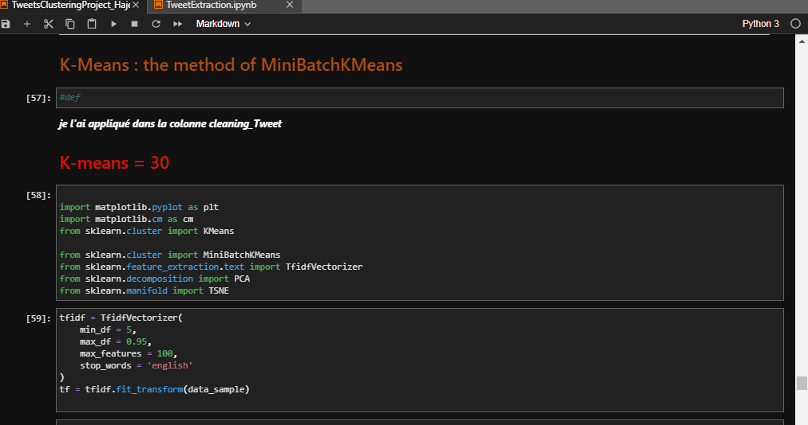

## Objectifs : 
*Maitriser l’API de twitter pour l’extraction des tweets 
*Maitriser la partie NLP (natural language processing) avec NLTK en Python 
*Appliquer les principes de nettoyage des données 
*Classer les tweets : regrouper ensemble les tweets qui sont similaires. C’est une étape qui peut être considérée comme une étape:
lien binder pour le travail de cleaning and clustering (TweetsClusteringProject_HajerMhimdi.ipynb)

lien binder pour l'extraction des API Tweets (TweetsClusteringProject_HajerMhimdi.ipynb)

#  
 vue globale etape d'extraction et cleaning data

#  
etape de clustering

###  
 Word2Vec method and cosinus Similarity

###  
 Mini batch Kmeans nombre Cluster =25 (exemple)

